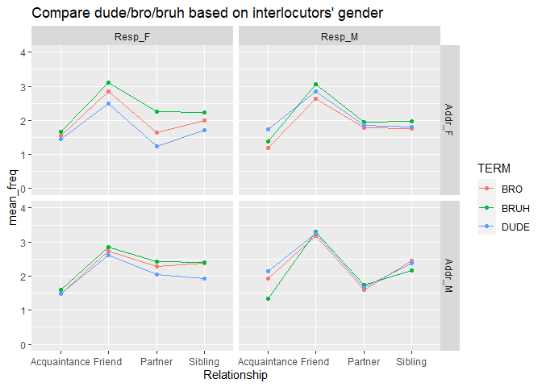

Untitled
================
Soobin Choi
2022-11-14

- <a href="#brobruh-sentence" id="toc-brobruh-sentence">Bro/bruh
  sentence</a>
- <a href="#compare-dudebro-based-on-gender-identity-total-at"
  id="toc-compare-dudebro-based-on-gender-identity-total-at">Compare
  dude/bro based on gender identity (total AT)</a>
- <a href="#compare-dudebrobruh-based-on-interlocutors-gender"
  id="toc-compare-dudebrobruh-based-on-interlocutors-gender">Compare
  dude/bro/bruh based on interlocutors’ gender</a>
- <a href="#compare-only-dude-all-relationship"
  id="toc-compare-only-dude-all-relationship">Compare only ‘dude’. (all
  relationship)</a>
  - <a href="#non-heteros-usage-of-dudebro"
    id="toc-non-heteros-usage-of-dudebro">Non-hetero’s usage of dude/bro</a>
- <a href="#sexuality-dudebro" id="toc-sexuality-dudebro">Sexuality
  dude/bro</a>
- <a href="#응답자-젠더에-따른-dudebro사용-그래프"
  id="toc-응답자-젠더에-따른-dudebro사용-그래프">응답자 젠더에 따른
  dude/bro사용 그래프</a>
- <a href="#at-depending-on-sexuality"
  id="toc-at-depending-on-sexuality">AT depending on sexuality</a>
- <a href="#non-heteros-other-at-usage-현황"
  id="toc-non-heteros-other-at-usage-현황">Non-hetero’s other AT usage
  현황</a>
- <a href="#part-3-문장-순서-배열" id="toc-part-3-문장-순서-배열">Part 3.
  문장 순서 배열.</a>
- <a href="#others" id="toc-others">Others</a>

``` r
knitr::opts_chunk$set(echo=TRUE, include=TRUE, comment="")
library(tidyverse)
library(tidytext)
library(dplyr)
library(stopwords)
```

    ## Warning: 패키지 'stopwords'는 R 버전 4.2.2에서 작성되었습니다

## Bro/bruh sentence

``` r
raw <- read_csv("C:/Users/82102/Desktop/Data_Science/Language-Gender-Sexuality/data/final_raw.csv")
```

    Rows: 22344 Columns: 8
    ── Column specification ────────────────────────────────────────────────────────
    Delimiter: ","
    chr (7): ADDR-GENDER, ADDR-RANK, TERM, RESP-GENDER, AGE, RESP-ID, AT-USE-GEN...
    dbl (1): FREQUENCY

    ℹ Use `spec()` to retrieve the full column specification for this data.
    ℹ Specify the column types or set `show_col_types = FALSE` to quiet this message.

``` r
head(raw, 10)
```

    # A tibble: 10 × 8
       `ADDR-GENDER` `ADDR-RANK` TERM  FREQUENCY `RESP-GENDER` AGE   RESP-…¹ AT-US…²
       <chr>         <chr>       <chr>     <dbl> <chr>         <chr> <chr>   <chr>  
     1 Feminine      Parent      BRO           2 Feminine      18-25 R_3PzQ… bro    
     2 Feminine      Parent      BRO           0 Masculine     18-25 R_33ki… bro    
     3 Feminine      Parent      BRO           4 Feminine      18-25 R_XjNC… bro,br…
     4 Feminine      Parent      BRO           2 Feminine      18-25 R_3Mfm… bro,br…
     5 Feminine      Parent      BRO           1 Feminine      18-25 R_1rpO… bro,br…
     6 Feminine      Parent      BRO           1 Masculine     18-25 R_2799… bro,br…
     7 Feminine      Parent      BRO           2 Feminine      18-25 R_1gFn… bro,br…
     8 Feminine      Parent      BRO           0 Masculine     18-25 R_1LGo… bro,br…
     9 Feminine      Parent      BRO           0 Feminine      18-25 R_3EHg… bro,br…
    10 Feminine      Parent      BRO          NA Feminine      18-25 R_1pRk… bro,br…
    # … with abbreviated variable names ¹​`RESP-ID`, ²​`AT-USE-GENERAL`

``` r
raw2 <- raw %>% 
  select(`ADDR-GENDER`:`RESP-GENDER`, AGE, `RESP-ID`:`AT-USE-GENERAL`) 

raw %>% 
  filter(TERM %in% c('BRO', 'BRUH', 'DUDE')) %>% 
  group_by(TERM, `ADDR-RANK`) %>% 
  na.omit() %>% 
  summarize(mean_freq = mean(FREQUENCY)) %>% 
  filter(`ADDR-RANK` == 'Stranger')
```

    `summarise()` has grouped output by 'TERM'. You can override using the
    `.groups` argument.

    # A tibble: 3 × 3
    # Groups:   TERM [3]
      TERM  `ADDR-RANK` mean_freq
      <chr> <chr>           <dbl>
    1 BRO   Stranger         1.12
    2 BRUH  Stranger         1.18
    3 DUDE  Stranger         1.18

``` r
raw %>% 
  na.omit(FREQUENCY) %>% 
  filter(`ADDR-RANK` == 'Stranger') %>% 
  group_by(FREQUENCY) %>%
  summarize(num = n_distinct(`RESP-ID`))
```

    # A tibble: 5 × 2
      FREQUENCY   num
          <dbl> <int>
    1         0   182
    2         1   144
    3         2    83
    4         3    37
    5         4    39

``` r
raw_sent <- read_csv("C:/Users/82102/Desktop/Data_Science/Language-Gender-Sexuality/data/final_ranksents.csv")
```

    Rows: 228 Columns: 19
    ── Column specification ────────────────────────────────────────────────────────
    Delimiter: ","
    chr  (1): RESP-ID
    dbl (18): music_dude, music_bruh, music_bro, meeting_dude, meeting_bruh, mee...

    ℹ Use `spec()` to retrieve the full column specification for this data.
    ℹ Specify the column types or set `show_col_types = FALSE` to quiet this message.

``` r
brobruh <- read_csv("C:/Users/82102/Desktop/Data_Science/Language-Gender-Sexuality/data/BroBruh.csv")
```

    Rows: 228 Columns: 11
    ── Column specification ────────────────────────────────────────────────────────
    Delimiter: ","
    chr (11): RESP-ID, AT-USE-GENERAL, BRO-V-BRUH, GENDER, GENDER_ACQUAINT_TEXT,...

    ℹ Use `spec()` to retrieve the full column specification for this data.
    ℹ Specify the column types or set `show_col_types = FALSE` to quiet this message.

``` r
raw_sent_cln <- brobruh %>% 
  select(GENDER, `RESP-ID`) %>% 
  left_join(raw_sent, ., by = "RESP-ID") %>% 
  relocate(GENDER, .after = "RESP-ID") %>% 
  na.omit(GENDER) 

raw_sent_cln %>% 
  filter(GENDER %in% c('Feminine', 'Masculine', 'Non-binary')) %>% 
  group_by(GENDER) %>% 
  summarize(mutate(across(.cols = everything(), ~ mean(.x, na.rm = TRUE))))
```

    Warning in mean.default(.x, na.rm = TRUE): 인자가 수치형 또는 논리형이 아니므로
    NA를 반환합니다

    Warning in mean.default(.x, na.rm = TRUE): 인자가 수치형 또는 논리형이 아니므로
    NA를 반환합니다

    Warning in mean.default(.x, na.rm = TRUE): 인자가 수치형 또는 논리형이 아니므로
    NA를 반환합니다

    # A tibble: 3 × 20
      GENDER RESP-…¹ music…² music…³ music…⁴ meeti…⁵ meeti…⁶ meeti…⁷ shut_…⁸ shut_…⁹
      <chr>    <dbl>   <dbl>   <dbl>   <dbl>   <dbl>   <dbl>   <dbl>   <dbl>   <dbl>
    1 Femin…      NA    2.04    3.59    2.50    2.02    3.55    2.58    1.93    3.47
    2 Mascu…      NA    1.98    3.20    2.04    2.10    3.10    2.10    1.90    2.98
    3 Non-b…      NA    2.17    2.33    2.67    2       2.67    2       2.5     2.67
    # … with 10 more variables: shut_bro <dbl>, goodtosee_dude <dbl>,
    #   goodtosee_bruh <dbl>, goodtosee_bro <dbl>, signal_dude <dbl>,
    #   signal_bruh <dbl>, signal_bro <dbl>, email_dude <dbl>, email_bruh <dbl>,
    #   email_bro <dbl>, and abbreviated variable names ¹​`RESP-ID`, ²​music_dude,
    #   ³​music_bruh, ⁴​music_bro, ⁵​meeting_dude, ⁶​meeting_bruh, ⁷​meeting_bro,
    #   ⁸​shut_dude, ⁹​shut_bruh

``` r
# dude / bro comparison in speech events


#raw_sent %>% 
#  select(ends_with('dude'), ends_with('_bro'), `RESP-ID`) %>% 
#  mutate(AT = c('dude')) %>% 
#  relocate(AT, `RESP-ID`, .before = music_dude) %>% 
#  rename(remove(ends_with('_dude')))
  
# data wrangling

raw_sent_cln %>% 
  select(-`RESP-ID`, -GENDER) %>% 
  select(ends_with("_dude"))
```

    # A tibble: 177 × 6
       music_dude meeting_dude shut_dude goodtosee_dude signal_dude email_dude
            <dbl>        <dbl>     <dbl>          <dbl>       <dbl>      <dbl>
     1          1            2         2              1           1          1
     2          2            3         1              2           1          1
     3          4            3         4              1           4          4
     4          1            1         1              2           1          1
     5          3            3         4              2           4          3
     6          1            1         2              1           2          2
     7          2            3         2              3           1          3
     8          1            1         1              1           1          1
     9          1            2         2              2           1          2
    10          1            1         2              1           2          2
    # … with 167 more rows

## Compare dude/bro based on gender identity (total AT)

``` r
raw %>% 
  select(`ADDR-GENDER`, TERM, `RESP-GENDER`, `ADDR-RANK`, AGE, `RESP-ID`) %>% 
  filter(TERM == "DUDE", `RESP-GENDER` %in% c("Feminine", "Masculine"),
         `ADDR-RANK` == "Sibling") %>%  
  ggplot(aes(x = `ADDR-GENDER`, fill = `RESP-GENDER`)) + 
  geom_bar(position = "dodge")
```

<!-- -->

``` r
raw %>% 
  select(`ADDR-GENDER`, `RESP-GENDER`, TERM, `ADDR-RANK`, AGE, `RESP-ID`) %>% 
  filter(TERM == "BRO", `RESP-GENDER` %in% c("Feminine", "Masculine"),
         `ADDR-RANK` == "Sibling") %>% 
  ggplot(aes(x = `ADDR-GENDER`, fill = `RESP-GENDER`)) + 
  geom_bar(position = "dodge")
```

<!-- -->

``` r
# 1
raw %>% 
  na.omit(FREQUENCY) %>% 
  filter(TERM %in% c("BRO", "DUDE"),
         `RESP-GENDER` %in% c("Masculine", "Feminine")) %>% 
  group_by(`ADDR-GENDER`, `RESP-GENDER`, `ADDR-RANK`, TERM) %>% 
  summarize(mean_freq = mean(FREQUENCY)) %>% 
  ggplot(aes(x = `ADDR-RANK`, y = mean_freq, group = TERM, color = TERM)) +
  facet_grid(`ADDR-GENDER` ~ `RESP-GENDER`, labeller = labeller(
               `ADDR-GENDER` = c(`Feminine`="Addr_F", `Masculine`="Addr_M"),
               `RESP-GENDER` = c(`Feminine`="Resp_F", `Masculine`="Resp_M"))) + 
  geom_line() +
  geom_point() + 
  scale_y_continuous(limits = c(0, 4)) +
  labs(title = "Compare dude/bro based on interlocutors' gender", x = 'address term')
```

    `summarise()` has grouped output by 'ADDR-GENDER', 'RESP-GENDER', 'ADDR-RANK'.
    You can override using the `.groups` argument.

<!-- -->

``` r
# 2
raw %>% 
  na.omit(FREQUENCY) %>% 
  filter(TERM %in% c("BRO", "DUDE"),
         `RESP-GENDER` %in% c("Masculine", "Feminine")) %>% 
  group_by(`ADDR-GENDER`, `ADDR-RANK`, TERM) %>% 
  summarize(mean_freq = mean(FREQUENCY)) %>% 
  ggplot(aes(x = `ADDR-RANK`, y = mean_freq, group = TERM, color = TERM)) +
  facet_grid(vars(`ADDR-GENDER`), labeller = labeller(
               `ADDR-GENDER` = c(`Feminine`="Addr_F", `Masculine`="Addr_M"))) + 
  geom_line() +
  geom_point() + 
  scale_y_continuous(limits = c(0, 3)) +
  labs(title = "Compare dude/bro based on gender identity", x = 'Relationship')
```

    `summarise()` has grouped output by 'ADDR-GENDER', 'ADDR-RANK'. You can
    override using the `.groups` argument.

<!-- -->

``` r
a <- raw %>% 
  na.omit(FREQUENCY) %>% 
  filter(TERM %in% c("BRO", "DUDE"),
         `RESP-GENDER` %in% c("Masculine", "Feminine")) %>% 
  group_by(`RESP-GENDER`, `ADDR-RANK`, TERM) %>% 
  summarize(mean_freq = mean(FREQUENCY)) %>% 
  ggplot(aes(x = `ADDR-RANK`, y = mean_freq, group = TERM, color = TERM)) +
  facet_grid(vars(`RESP-GENDER`), labeller = labeller(
               `RESP-GENDER` = c(`Feminine`="Resp_F", `Masculine`="Resp_M"))) + 
  geom_line() +
  geom_point() + 
  scale_y_continuous(limits = c(0, 3.2)) +
  labs(title = "Compare dude/bro based on gender identity", x = 'Relationship')
```

    `summarise()` has grouped output by 'RESP-GENDER', 'ADDR-RANK'. You can
    override using the `.groups` argument.

``` r
print(a)
```

<!-- -->

## Compare dude/bro/bruh based on interlocutors’ gender

``` r
raw
```

    # A tibble: 22,344 × 8
       `ADDR-GENDER` `ADDR-RANK` TERM  FREQUENCY `RESP-GENDER` AGE   RESP-…¹ AT-US…²
       <chr>         <chr>       <chr>     <dbl> <chr>         <chr> <chr>   <chr>  
     1 Feminine      Parent      BRO           2 Feminine      18-25 R_3PzQ… bro    
     2 Feminine      Parent      BRO           0 Masculine     18-25 R_33ki… bro    
     3 Feminine      Parent      BRO           4 Feminine      18-25 R_XjNC… bro,br…
     4 Feminine      Parent      BRO           2 Feminine      18-25 R_3Mfm… bro,br…
     5 Feminine      Parent      BRO           1 Feminine      18-25 R_1rpO… bro,br…
     6 Feminine      Parent      BRO           1 Masculine     18-25 R_2799… bro,br…
     7 Feminine      Parent      BRO           2 Feminine      18-25 R_1gFn… bro,br…
     8 Feminine      Parent      BRO           0 Masculine     18-25 R_1LGo… bro,br…
     9 Feminine      Parent      BRO           0 Feminine      18-25 R_3EHg… bro,br…
    10 Feminine      Parent      BRO          NA Feminine      18-25 R_1pRk… bro,br…
    # … with 22,334 more rows, and abbreviated variable names ¹​`RESP-ID`,
    #   ²​`AT-USE-GENERAL`

``` r
colnames(raw)
```

    [1] "ADDR-GENDER"    "ADDR-RANK"      "TERM"           "FREQUENCY"     
    [5] "RESP-GENDER"    "AGE"            "RESP-ID"        "AT-USE-GENERAL"

``` r
raw %>% 
  na.omit(FREQUENCY) %>% 
  select(-`AT-USE-GENERAL`) %>% 
  filter(`RESP-GENDER` %in% c("Feminine", "Masculine"), 
         `ADDR-RANK` %in% c("Acquaintance", "Friend", "Partner", "Sibling"),
         TERM %in% c("BRO", "DUDE", "BRUH")) %>% 
  group_by(`ADDR-RANK`, TERM, `RESP-GENDER`, `ADDR-GENDER`) %>% 
  summarize(mean_freq = mean(FREQUENCY)) %>% 
#  filter(mean_freq>=2) %>% 
  ggplot(aes(x = `ADDR-RANK`, y = mean_freq,  group = TERM, col = TERM)) +
  facet_grid(`ADDR-GENDER` ~ `RESP-GENDER`, labeller = labeller(
               `ADDR-GENDER` = c(`Feminine`="Addr_F", `Masculine`="Addr_M"),
               `RESP-GENDER` = c(`Feminine`="Resp_F", `Masculine`="Resp_M"))) + 
  geom_line() +
  geom_point() + 
  scale_y_continuous(limits = c(0, 4)) +
  labs(title = "Compare dude/bro/bruh based on interlocutors' gender", x = 'Relationship')
```

    `summarise()` has grouped output by 'ADDR-RANK', 'TERM', 'RESP-GENDER'. You can
    override using the `.groups` argument.

<!-- -->

``` r
# Compare all ATs based on interlocutors' gender

raw %>% 
  na.omit(FREQUENCY) %>% 
  select(-`AT-USE-GENERAL`) %>% 
  filter(`RESP-GENDER` %in% c("Feminine", "Masculine")) %>% 
  group_by(`ADDR-RANK`, TERM, `RESP-GENDER`, `ADDR-GENDER`) %>% 
  summarize(mean_freq = mean(FREQUENCY)) %>% 
#  filter(mean_freq>=2) %>% 
  ggplot(aes(x = `ADDR-RANK`, y = mean_freq,  group = TERM, col = TERM)) +
  facet_wrap(`ADDR-GENDER` ~ `RESP-GENDER`, ncol = 1, strip.position = c("right"), labeller = labeller(
               `ADDR-GENDER` = c(`Feminine`="Addr_F", `Masculine`="Addr_M"),
               `RESP-GENDER` = c(`Feminine`="Resp_F", `Masculine`="Resp_M"))) + 
  geom_line() +
  geom_point() + 
  scale_y_continuous(limits = c(0, 4)) +
  labs(title = "Compare all ATs based on interlocutors' gender", x = 'Relationship')
```

    `summarise()` has grouped output by 'ADDR-RANK', 'TERM', 'RESP-GENDER'. You can
    override using the `.groups` argument.

<!-- -->

``` r
# compare dude/bro/bruh/girl만.

raw %>% 
  na.omit(FREQUENCY) %>% 
  select(-`AT-USE-GENERAL`) %>% 
  filter(`RESP-GENDER` %in% c("Feminine", "Masculine"),
         TERM %in% c("DUDE", "BRO", "GIRL", "BRUH")) %>% 
  group_by(`ADDR-RANK`, TERM, `RESP-GENDER`, `ADDR-GENDER`) %>% 
  summarize(mean_freq = mean(FREQUENCY)) %>% 
#  filter(mean_freq>=2) %>% 
  ggplot(aes(x = `ADDR-RANK`, y = mean_freq,  group = TERM, col = TERM)) +
  facet_wrap(`ADDR-GENDER` ~ `RESP-GENDER`, ncol = 1, strip.position = c("right"), labeller = labeller(
               `ADDR-GENDER` = c(`Feminine`="Addr_F", `Masculine`="Addr_M"),
               `RESP-GENDER` = c(`Feminine`="Resp_F", `Masculine`="Resp_M"))) + 
  geom_line() +
  geom_point() + 
  scale_y_continuous(limits = c(0, 4)) +
  labs(title = "Compare all ATs based on interlocutors' gender", x = 'Relationship')
```

    `summarise()` has grouped output by 'ADDR-RANK', 'TERM', 'RESP-GENDER'. You can
    override using the `.groups` argument.

<!-- -->

``` r
# Compare dude/bro based on interlocutors' gender
raw %>% 
  na.omit(FREQUENCY) %>% 
  select(-`AT-USE-GENERAL`) %>% 
  filter(`RESP-GENDER` %in% c("Feminine", "Masculine"),
         TERM %in% c("DUDE", "BRO")) %>% 
  group_by(`ADDR-RANK`, TERM, `RESP-GENDER`, `ADDR-GENDER`) %>% 
  summarize(mean_freq = mean(FREQUENCY)) %>% 
#  filter(mean_freq>=2) %>% 
  ggplot(aes(x = `ADDR-RANK`, y = mean_freq,  group = TERM, col = TERM)) +
  facet_wrap(`RESP-GENDER` ~ `ADDR-GENDER`, ncol = 1, strip.position = c("right"), labeller = labeller(
               `ADDR-GENDER` = c(`Feminine`="Addr_F", `Masculine`="Addr_M"),
               `RESP-GENDER` = c(`Feminine`="Resp_F", `Masculine`="Resp_M"))) + 
  geom_line() +
  geom_point() + 
  scale_y_continuous(limits = c(0, 3.5)) +
  labs(title = "Compare dude/bro based on interlocutors' gender", x = 'Relationship')
```

    `summarise()` has grouped output by 'ADDR-RANK', 'TERM', 'RESP-GENDER'. You can
    override using the `.groups` argument.

<!-- -->

``` r
# 담화자 젠더별 mean freq

raw %>% 
  na.omit(FREQUENCY) %>% 
  select(-`AT-USE-GENERAL`) %>% 
  filter(`RESP-GENDER` %in% c("Feminine", "Masculine"),
        `ADDR-RANK` == "Partner",
        TERM == "DUDE") %>% 
  group_by(`ADDR-RANK`, TERM, `RESP-GENDER`, `ADDR-GENDER`) %>% 
  summarize(mean_freq = mean(FREQUENCY)) %>% 
  unite(Gender, `RESP-GENDER`, `ADDR-GENDER`) %>% 
  ggplot(aes(x = Gender, y = mean_freq, fill = Gender)) +
  geom_bar(stat = "identity")
```

    `summarise()` has grouped output by 'ADDR-RANK', 'TERM', 'RESP-GENDER'. You can
    override using the `.groups` argument.

<!-- -->

``` r
raw %>% 
  na.omit(FREQUENCY) %>% 
  group_by(`ADDR-RANK`) %>% 
  summarise(mean_total = mean(FREQUENCY))
```

    # A tibble: 7 × 2
      `ADDR-RANK`  mean_total
      <chr>             <dbl>
    1 Acquaintance      1.41 
    2 Friend            2.56 
    3 Parent            0.826
    4 Partner           1.65 
    5 Sibling           1.81 
    6 Stranger          1.01 
    7 Supervisor        0.325

``` r
unique(raw$`ADDR-RANK`)
```

    [1] "Parent"       "Sibling"      "Partner"      "Acquaintance" "Supervisor"  
    [6] "Friend"       "Stranger"    

``` r
# 네 개 라인 한번에
raw %>% 
  na.omit(FREQUENCY) %>% 
  select(-`AT-USE-GENERAL`) %>% 
  filter(`RESP-GENDER` %in% c("Feminine", "Masculine"),
         TERM %in% c("DUDE")) %>% 
  group_by(`ADDR-RANK`, `RESP-GENDER`, `ADDR-GENDER`) %>% 
  summarize(mean_freq = mean(FREQUENCY)) %>% 
  unite(Gender, `RESP-GENDER`, `ADDR-GENDER`) %>% 
#  filter(mean_freq>=2) %>% 
  ggplot(aes(x = `ADDR-RANK`, y = mean_freq,  group = Gender, col = Gender)) +
  geom_line() +
  geom_point() + 
  labs(title = "DUDE")
```

    `summarise()` has grouped output by 'ADDR-RANK', 'RESP-GENDER'. You can
    override using the `.groups` argument.

<!-- -->

``` r
raw %>% 
  na.omit(FREQUENCY) %>% 
  select(-`AT-USE-GENERAL`) %>% 
  filter(`RESP-GENDER` %in% c("Feminine", "Masculine"),
         TERM %in% c("BRO")) %>% 
  group_by(`ADDR-RANK`, `RESP-GENDER`, `ADDR-GENDER`) %>% 
  summarize(mean_freq = mean(FREQUENCY)) %>% 
  unite(Gender, `RESP-GENDER`, `ADDR-GENDER`) %>% 
#  filter(mean_freq>=2) %>% 
  ggplot(aes(x = `ADDR-RANK`, y = mean_freq,  group = Gender, col = Gender)) +
  geom_line() +
  geom_point() + 
  labs(title = "BRO")
```

    `summarise()` has grouped output by 'ADDR-RANK', 'RESP-GENDER'. You can
    override using the `.groups` argument.

<!-- -->

``` r
#########################################################################


raw %>% 
  na.omit(FREQUENCY) %>% 
  select(-`AT-USE-GENERAL`) %>% 
  filter(`RESP-GENDER` %in% c("Feminine", "Masculine"),
         TERM %in% c("DUDE")) %>% 
  group_by(`ADDR-RANK`, `RESP-GENDER`) %>% 
  summarize(mean_freq = mean(FREQUENCY)) %>% 
  ggplot(aes(x = `ADDR-RANK`, y = mean_freq,  group = `RESP-GENDER`, col = `RESP-GENDER`)) +
  geom_line() +
  geom_point() +
  labs(title = "DUDE")
```

    `summarise()` has grouped output by 'ADDR-RANK'. You can override using the
    `.groups` argument.

<!-- -->

``` r
raw %>% 
  na.omit(FREQUENCY) %>% 
  select(-`AT-USE-GENERAL`) %>% 
  filter(`RESP-GENDER` %in% c("Feminine", "Masculine"),
         TERM %in% c("BRO")) %>% 
  group_by(`ADDR-RANK`, `RESP-GENDER`) %>% 
  summarize(mean_freq = mean(FREQUENCY)) %>% 
  ggplot(aes(x = `ADDR-RANK`, y = mean_freq,  group = `RESP-GENDER`, col = `RESP-GENDER`)) +
  geom_line() +
  geom_point()
```

    `summarise()` has grouped output by 'ADDR-RANK'. You can override using the
    `.groups` argument.

<!-- -->

# Compare only ‘dude’. (all relationship)

``` r
raw %>% 
  na.omit(FREQUENCY) %>% 
  select(-`AT-USE-GENERAL`) %>% 
  filter(`RESP-GENDER` %in% c("Masculine", "Feminine"),
         TERM %in% c("DUDE")) %>% 
  group_by(`ADDR-RANK`, TERM, `RESP-GENDER`, `ADDR-GENDER`) %>% 
  summarize(mean_freq = mean(FREQUENCY)) %>% 
#  filter(mean_freq>=2) %>% 
  ggplot(aes(x = `ADDR-RANK`, y = mean_freq,  group = TERM)) +
  facet_wrap(`RESP-GENDER`~`ADDR-GENDER`, ncol = 1, strip.position = c("right"), 
             labeller = labeller(
             `RESP-GENDER` = c(`Feminine`="Resp_F", `Masculine`="Resp_M"),
             `ADDR-GENDER` = c(`Feminine`="Addr_F", `Masculine`="Addr_M"))) + 
  geom_line() +
  geom_point() + 
  scale_y_continuous(limits = c(0, 3.5)) +
  labs(title = "Compare dude based on interlocutors' gender", x = 'Relationship')
```

    `summarise()` has grouped output by 'ADDR-RANK', 'TERM', 'RESP-GENDER'. You can
    override using the `.groups` argument.

<!-- -->

``` r
raw %>% 
  na.omit(FREQUENCY) %>% 
  select(-`AT-USE-GENERAL`) %>% 
  filter(`RESP-GENDER` %in% c("Masculine", "Feminine"),
         TERM %in% c("DUDE")) %>% 
  group_by(`RESP-GENDER`, `ADDR-GENDER`) %>% 
  summarize(mean_freq = mean(FREQUENCY)) %>% 
  ggplot(aes(x = `RESP-GENDER`, y = mean_freq, col = `ADDR-GENDER`, group = `ADDR-GENDER`))+
  geom_point() + 
  geom_path()
```

    `summarise()` has grouped output by 'RESP-GENDER'. You can override using the
    `.groups` argument.

<!-- -->

## Non-hetero’s usage of dude/bro

``` r
sexual <- brobruh %>% 
  select(SEXRECODE, `RESP-ID`)

dudebro <- raw %>% 
  select(`RESP-ID`, `AT-USE-GENERAL`) %>% 
  filter(`AT-USE-GENERAL` %in% c("dude", "bro")) %>% 
  left_join(., sexual, by = "RESP-ID") %>% 
  na.omit(SEXRECODE)


AT <- c("bro","bruh","dude","girl","man","my dude","queen")

raw %>% 
  select(`RESP-ID`, `AT-USE-GENERAL`) %>% 
  map(~ str_split(., ",")) %>% 
  as_data_frame() %>% 
  unnest(`RESP-ID`, `AT-USE-GENERAL`) %>% 
  filter(`AT-USE-GENERAL` %in% c("dude", "bro")) %>% 
  left_join(., sexual, by = "RESP-ID") %>% 
  filter(SEXRECODE %in% c("Asexual", "Bi", "Gay", "Lesbian", "Pan", "Queer", "Other")) %>% 
  group_by(SEXRECODE) %>% 
  summarize(num = length(SEXRECODE))
```

    Warning: `as_data_frame()` was deprecated in tibble 2.0.0.
    Please use `as_tibble()` instead.
    The signature and semantics have changed, see `?as_tibble`.
    This warning is displayed once every 8 hours.
    Call `lifecycle::last_lifecycle_warnings()` to see where this warning was generated.

    Warning: unnest() has a new interface. See ?unnest for details.
    Try `df %>% unnest(c(`RESP-ID`, `AT-USE-GENERAL`))`, with `mutate()` if needed

    # A tibble: 7 × 2
      SEXRECODE   num
      <chr>     <int>
    1 Asexual     392
    2 Bi         7938
    3 Gay        1764
    4 Lesbian    1078
    5 Other       784
    6 Pan        1666
    7 Queer      1470

``` r
raw %>% 
  select(`RESP-ID`, `AT-USE-GENERAL`) %>% 
  map(~ str_split(., ",")) %>% 
  as_data_frame() %>% 
  unnest(`RESP-ID`) %>% 
  filter(`AT-USE-GENERAL` %in% c("dude", "bro")) %>% 
  left_join(., sexual, by = "RESP-ID") %>% 
  arrange(`RESP-ID`)
```

    # A tibble: 1,372 × 3
       `RESP-ID`         `AT-USE-GENERAL` SEXRECODE
       <chr>             <list>           <chr>    
     1 R_1CD3LNgloXCZ42w <chr [1]>        Lesbian  
     2 R_1CD3LNgloXCZ42w <chr [1]>        Lesbian  
     3 R_1CD3LNgloXCZ42w <chr [1]>        Lesbian  
     4 R_1CD3LNgloXCZ42w <chr [1]>        Lesbian  
     5 R_1CD3LNgloXCZ42w <chr [1]>        Lesbian  
     6 R_1CD3LNgloXCZ42w <chr [1]>        Lesbian  
     7 R_1CD3LNgloXCZ42w <chr [1]>        Lesbian  
     8 R_1CD3LNgloXCZ42w <chr [1]>        Lesbian  
     9 R_1CD3LNgloXCZ42w <chr [1]>        Lesbian  
    10 R_1CD3LNgloXCZ42w <chr [1]>        Lesbian  
    # … with 1,362 more rows

``` r
raw %>% 
  select(`RESP-ID`, `AT-USE-GENERAL`) %>%
  mutate(dude = grepl("dude", `AT-USE-GENERAL`),
          bro = grepl("bro",  `AT-USE-GENERAL`)) %>% 
  left_join(., sexual, by = "RESP-ID") %>% 
  filter(SEXRECODE %in% c("Asexual", "Bi", "Gay", "Lesbian", "Pan", "Queer", "Other")) %>% 
  group_by(SEXRECODE) %>% 
  summarize(num = length(SEXRECODE))
```

    # A tibble: 7 × 2
      SEXRECODE   num
      <chr>     <int>
    1 Asexual     196
    2 Bi         4508
    3 Gay        1470
    4 Lesbian     784
    5 Other       490
    6 Pan         882
    7 Queer      1078

``` r
dude <- raw %>% 
  filter(`ADDR-RANK` == "Parent", TERM == "BRO", `ADDR-GENDER` == "Feminine") %>% 
  select(`RESP-ID`, `AT-USE-GENERAL`) %>%
  mutate(AT = grepl("dude", `AT-USE-GENERAL`)) %>% 
  left_join(., sexual, by = "RESP-ID")

bro <- raw %>% 
  filter(`ADDR-RANK` == "Parent", TERM == "BRO", `ADDR-GENDER` == "Feminine") %>% 
  select(`RESP-ID`, `AT-USE-GENERAL`) %>%
  mutate(AT = grepl("bro", `AT-USE-GENERAL`)) %>% 
  left_join(., sexual, by = "RESP-ID")


brodude <- dude %>% 
  select(AT, `RESP-ID`) %>% 
  mutate(AT_dude = AT) %>% 
  left_join(., bro %>%   mutate(AT_bro = AT), by = "RESP-ID") %>% 
  select(-AT.x, -AT.y) %>% 
  relocate(AT_dude, .before = "AT_bro")

# dude/bro usage based on sexuality

dude_use <- brodude %>% 
  map(~ str_replace_all(., "(Asexual|Bi|Gay|Lesbian|Pan|Queer|Other)", "non_Het")) %>% 
  as_data_frame() %>% 
  na.omit(SEXRECODE) %>% 
  mutate_all(funs(str_replace(., "FALSE", "NO USE"))) %>% 
  mutate_all(funs(str_replace(., "TRUE", "USE"))) %>% 
  group_by(SEXRECODE, AT_dude) %>% 
  summarize(Count = n()) %>%
  ggplot(aes(x = SEXRECODE, y = Count, fill = AT_dude)) + 
  geom_col(position = "dodge") + 
  labs(title = "dude usage based on sexuality", x = "Sexuality")
```

    Warning: `funs()` was deprecated in dplyr 0.8.0.
    Please use a list of either functions or lambdas: 

      # Simple named list: 
      list(mean = mean, median = median)

      # Auto named with `tibble::lst()`: 
      tibble::lst(mean, median)

      # Using lambdas
      list(~ mean(., trim = .2), ~ median(., na.rm = TRUE))
    This warning is displayed once every 8 hours.
    Call `lifecycle::last_lifecycle_warnings()` to see where this warning was generated.

    `summarise()` has grouped output by 'SEXRECODE'. You can override using the
    `.groups` argument.

``` r
bro_use <- brodude %>% 
  map(~ str_replace_all(., "(Asexual|Bi|Gay|Lesbian|Pan|Queer|Other)", "non_Het")) %>% 
  as_data_frame() %>% 
  na.omit(SEXRECODE) %>% 
  mutate_all(funs(str_replace(., "FALSE", "NO USE"))) %>% 
  mutate_all(funs(str_replace(., "TRUE", "USE"))) %>% 
  group_by(SEXRECODE, AT_bro) %>% 
  summarize(Count = n()) %>%
  ggplot(aes(x = SEXRECODE, y = Count, fill = AT_bro)) + 
  geom_col(position = "dodge") + 
  scale_y_continuous(limits = c(0,80)) + 
  labs(title = "bro usage based on sexuality", x = "Sexuality")
```

    `summarise()` has grouped output by 'SEXRECODE'. You can override using the
    `.groups` argument.

``` r
dude_use
```

<!-- -->

``` r
bro_use
```

<!-- -->

# Sexuality dude/bro

``` r
sexual
```

    # A tibble: 228 × 2
       SEXRECODE `RESP-ID`        
       <chr>     <chr>            
     1 Het       R_33kiGGca4LUT1CY
     2 Het       R_3PzQdcTJzYbZXKv
     3 Other     R_1LGoOEmO4vEWEFM
     4 <NA>      R_10pBzbfQuNcvT4m
     5 Pan       R_XjNCWoHHPn6Vgu5
     6 Het       R_1gFnojyf6wsLeNv
     7 Het       R_1rpOK7Kq0W3PGPI
     8 Het       R_27990m3pU4KhkgU
     9 Het       R_3MfmOPcGaPLV1zP
    10 Pan       R_1pRksLPihqfNrsj
    # … with 218 more rows

``` r
raw %>% 
  left_join(., sexual, by = "RESP-ID") %>% 
  map(~ str_replace_all(., "(Asexual|Bi|Gay|Lesbian|Pan|Queer|Other)", "non_Het")) %>% 
  as_data_frame() %>% 
  na.omit(SEXRECODE) %>% 
  na.omit(FREQUENCY) %>% 
  select(-`AT-USE-GENERAL`) %>% 
  filter(`RESP-GENDER` %in% c("Feminine", "Masculine"),
         TERM %in% c("DUDE")) %>% 
  mutate(FREQUENCY = as.numeric(FREQUENCY)) %>% 
  group_by(`ADDR-RANK`, SEXRECODE) %>% 
  summarize(mean_freq = mean(FREQUENCY)) %>% 
  ggplot(aes(x = `ADDR-RANK`, y = mean_freq,  group = SEXRECODE, col = SEXRECODE)) +
  geom_line() +
  geom_point() + 
  labs(title = "sexuality")
```

    `summarise()` has grouped output by 'ADDR-RANK'. You can override using the
    `.groups` argument.

<!-- -->

# 응답자 젠더에 따른 dude/bro사용 그래프

``` r
# 응답자의 젠더에 따른 dude 사용 (수치)

raw %>% 
  filter(`ADDR-RANK` == "Parent", TERM == "BRO", `ADDR-GENDER` == "Feminine",
         `RESP-GENDER` %in% c("Masculine", "Feminine", "Non-binary")) %>% 
  select(`RESP-ID`, `AT-USE-GENERAL`, `RESP-GENDER`) %>%
  mutate(AT = grepl("dude", `AT-USE-GENERAL`)) %>% 
  mutate_all(funs(str_replace(., "FALSE", "NO USE"))) %>% 
  mutate_all(funs(str_replace(., "TRUE", "USE"))) %>% 
  group_by(`RESP-GENDER`, AT) %>% 
  summarize(Count = n())
```

    `summarise()` has grouped output by 'RESP-GENDER'. You can override using the
    `.groups` argument.

    # A tibble: 6 × 3
    # Groups:   RESP-GENDER [3]
      `RESP-GENDER` AT     Count
      <chr>         <chr>  <int>
    1 Feminine      NO USE    33
    2 Feminine      USE      123
    3 Masculine     NO USE    12
    4 Masculine     USE       49
    5 Non-binary    NO USE     2
    6 Non-binary    USE        7

``` r
# 응답자의 젠더에 따른 dude 사용 (그래프)

raw %>% 
  filter(`ADDR-RANK` == "Parent", TERM == "BRO", `ADDR-GENDER` == "Feminine",
         `RESP-GENDER` %in% c("Masculine", "Feminine", "Non-binary")) %>% 
  select(`RESP-ID`, `AT-USE-GENERAL`, `RESP-GENDER`) %>%
  mutate(AT = grepl("dude", `AT-USE-GENERAL`)) %>% 
  mutate_all(funs(str_replace(., "FALSE", "NO USE"))) %>% 
  mutate_all(funs(str_replace(., "TRUE", "USE"))) %>% 
  group_by(`RESP-GENDER`, AT) %>% 
  summarize(Count = n()) %>%
  ggplot(aes(x = `RESP-GENDER`, y = Count, fill = AT)) + 
  geom_col(position = "dodge") + 
#  scale_y_continuous(limits = c(0,80)) + 
  labs(title = "dude usage based on sexuality", x = "Gender Identity")
```

    `summarise()` has grouped output by 'RESP-GENDER'. You can override using the
    `.groups` argument.

<!-- -->

``` r
# 응답자의 젠더에 따른 bro 사용 (그래프)

raw %>% 
  filter(`ADDR-RANK` == "Parent", TERM == "BRO", `ADDR-GENDER` == "Feminine",
         `RESP-GENDER` %in% c("Masculine", "Feminine", "Non-binary")) %>% 
  select(`RESP-ID`, `AT-USE-GENERAL`, `RESP-GENDER`) %>%
  mutate(AT = grepl("bro", `AT-USE-GENERAL`)) %>% 
  mutate_all(funs(str_replace(., "FALSE", "NO USE"))) %>% 
  mutate_all(funs(str_replace(., "TRUE", "USE"))) %>% 
  group_by(`RESP-GENDER`, AT) %>% 
  summarize(Count = n()) %>%
  ggplot(aes(x = `RESP-GENDER`, y = Count, fill = AT)) + 
  geom_col(position = "dodge") + 
#  scale_y_continuous(limits = c(0,80)) + 
  labs(title = "bro usage based on sexuality", x = "Gender Identity")
```

    `summarise()` has grouped output by 'RESP-GENDER'. You can override using the
    `.groups` argument.

<!-- -->

``` r
# 각 젠더별 응답자 수

raw %>% 
  filter(`ADDR-RANK` == "Parent", TERM == "BRO", `ADDR-GENDER` == "Feminine") %>% 
  group_by(`RESP-GENDER`) %>% 
  summarize(count = length(TERM))
```

    # A tibble: 4 × 2
      `RESP-GENDER`         count
      <chr>                 <int>
    1 Feminine                156
    2 Masculine                61
    3 Non-binary                9
    4 Other (please state):     2

# AT depending on sexuality

``` r
#raw %>% 
#  select()
#  map(~ str_replace_all(., "(Asexual|Bi|Gay|Lesbian|Pan|Queer|Other)", "non_Het")) 
  
  
raw %>% 
  select(`RESP-ID`, `AT-USE-GENERAL`) %>%
  mutate(dude = grepl("dude", `AT-USE-GENERAL`),
          bro = grepl("bro",  `AT-USE-GENERAL`)) %>% 
  left_join(., sexual, by = "RESP-ID") %>% 
  na.omit(SEXRECODE) %>% 
  map(~ str_replace_all(., "(Asexual|Bi|Gay|Lesbian|Pan|Queer|Other)", "non_Het")) %>% 
  as_data_frame()
```

    # A tibble: 18,816 × 5
       `RESP-ID`         `AT-USE-GENERAL`   dude  bro   SEXRECODE
       <chr>             <chr>              <chr> <chr> <chr>    
     1 R_3PzQdcTJzYbZXKv bro                FALSE TRUE  Het      
     2 R_33kiGGca4LUT1CY bro                FALSE TRUE  Het      
     3 R_XjNCWoHHPn6Vgu5 bro,bruh,dude      TRUE  TRUE  non_Het  
     4 R_3MfmOPcGaPLV1zP bro,bruh,dude      TRUE  TRUE  Het      
     5 R_1rpOK7Kq0W3PGPI bro,bruh,dude      TRUE  TRUE  Het      
     6 R_27990m3pU4KhkgU bro,bruh,dude      TRUE  TRUE  Het      
     7 R_1gFnojyf6wsLeNv bro,bruh,dude      TRUE  TRUE  Het      
     8 R_1LGoOEmO4vEWEFM bro,bruh,dude      TRUE  TRUE  non_Het  
     9 R_3EHgfeUNlq26yts bro,bruh,dude,girl TRUE  TRUE  non_Het  
    10 R_1pRksLPihqfNrsj bro,bruh,dude,girl TRUE  TRUE  non_Het  
    # … with 18,806 more rows

``` r
raw_sexual <- raw %>% 
  left_join(., sexual, by = "RESP-ID") %>% 
  relocate(SEXRECODE, .after = `RESP-ID`)

# 성지향성에 따른 AT 사용현황

raw_sexual %>% 
  na.omit(FREQUENCY) %>% 
  select(-`AT-USE-GENERAL`) %>% 
  na.omit(SEXRECODE) %>% 
  map_dfr(~ str_replace_all(., "(Asexual|Bi|Gay|Lesbian|Pan|Queer|Other)", "non_Het")) %>% 
  mutate(FREQUENCY = as.numeric(FREQUENCY)) %>% 
  group_by(`ADDR-RANK`, TERM, SEXRECODE) %>% 
  summarize(mean_freq = mean(FREQUENCY)) %>%
  ggplot(aes(x = `ADDR-RANK`, y = mean_freq, group = TERM, col = TERM)) +
  facet_grid(vars(SEXRECODE)) +
  geom_line() + 
  geom_point() +
  labs(title = "Compare all ATs based on interlocutors' sexuality", x = 'Relationship')
```

    `summarise()` has grouped output by 'ADDR-RANK', 'TERM'. You can override using
    the `.groups` argument.

<!-- -->

``` r
# 성지향성에 따른 dude/bro 사용현황

raw_sexual %>% 
  na.omit(FREQUENCY) %>% 
  select(-`AT-USE-GENERAL`) %>% 
  na.omit(SEXRECODE) %>% 
  map_dfr(~ str_replace_all(., "(Asexual|Bi|Gay|Lesbian|Pan|Queer|Other)", "non_Het")) %>% 
  mutate(FREQUENCY = as.numeric(FREQUENCY)) %>% 
  filter(TERM %in% c("DUDE", "BRO")) %>% 
  group_by(`ADDR-RANK`, TERM, SEXRECODE) %>% 
  summarize(mean_freq = mean(FREQUENCY)) %>%
  ggplot(aes(x = `ADDR-RANK`, y = mean_freq, group = TERM, col = TERM)) +
  facet_grid(vars(SEXRECODE)) +
  geom_line() + 
  geom_point() +
  labs(title = "Compare dude/bro based on interlocutors' sexuality", x = 'Relationship')
```

    `summarise()` has grouped output by 'ADDR-RANK', 'TERM'. You can override using
    the `.groups` argument.

<!-- -->

``` r
# non-hetero들의 girl 사용현황

raw_sexual %>% 
  na.omit(FREQUENCY) %>% 
  select(-`AT-USE-GENERAL`) %>% 
  na.omit(SEXRECODE) %>% 
  map_dfr(~ str_replace_all(., "(Asexual|Bi|Gay|Lesbian|Pan|Queer|Other)", "non_Het")) %>% 
  mutate(FREQUENCY = as.numeric(FREQUENCY)) %>% 
  filter(TERM %in% c("GIRL"), 
         SEXRECODE == "non_Het",
         `RESP-GENDER` %in% c("Feminine", "Masculine")) %>% 
  group_by(`ADDR-RANK`, `ADDR-GENDER`, `RESP-GENDER`, TERM) %>% 
  summarize(mean_freq = mean(FREQUENCY)) %>%
  ggplot(aes(x = `ADDR-RANK`, y = mean_freq,  group = TERM, col = TERM)) +
  facet_wrap(`RESP-GENDER`~`ADDR-GENDER`, ncol = 1, strip.position = c("right"), 
             labeller = labeller(
             `RESP-GENDER` = c(`Feminine`="Resp_F", `Masculine`="Resp_M"),
             `ADDR-GENDER` = c(`Feminine`="Addr_F", `Masculine`="Addr_M"))) + 
  geom_line() +
  geom_point() + 
  scale_y_continuous(limits = c(0, 3.5)) +
  labs(title = "Non-Heteros' usage of girl")
```

    `summarise()` has grouped output by 'ADDR-RANK', 'ADDR-GENDER', 'RESP-GENDER'.
    You can override using the `.groups` argument.

<!-- -->

# Non-hetero’s other AT usage 현황

``` r
# graph

raw_sexual %>% 
  na.omit(FREQUENCY) %>% 
  select(-`AT-USE-GENERAL`) %>% 
  na.omit(SEXRECODE) %>% 
  map_dfr(~ str_replace_all(., "(Asexual|Bi|Gay|Lesbian|Pan|Queer|Other)", "non_Het")) %>% 
  mutate(FREQUENCY = as.numeric(FREQUENCY)) %>% 
  filter(TERM %in% c("GIRL", "MAN", "QUEEN", "MYDUDE")) %>% 
  group_by(`ADDR-RANK`, TERM, SEXRECODE) %>% 
  summarize(mean_freq = mean(FREQUENCY)) %>%
  ggplot(aes(x = `ADDR-RANK`, y = mean_freq, group = TERM, col = TERM)) +
  facet_grid(vars(SEXRECODE)) +
  geom_line() + 
  geom_point() +
  labs(title = "Compare other ATs based on interlocutors' sexuality", x = 'Relationship')
```

    `summarise()` has grouped output by 'ADDR-RANK', 'TERM'. You can override using
    the `.groups` argument.

<!-- -->

``` r
raw_sexual %>% 
  select(SEXRECODE) %>% 
  unique()
```

    # A tibble: 9 × 1
      SEXRECODE
      <chr>    
    1 Het      
    2 Pan      
    3 Other    
    4 Bi       
    5 <NA>     
    6 Queer    
    7 Gay      
    8 Lesbian  
    9 Asexual  

# Part 3. 문장 순서 배열.

``` r
sent_clean <- brobruh  %>% 
  rename(Sent = `BRO-V-BRUH`) %>% 
  select(GENDER, SEXRECODE, Sent) %>% 
  na.omit(SEXRECODE) 

snowball <- stopwords(language = "en", source = "snowball", simplify = TRUE)
nltk <- stopwords(language = "en", source = "nltk", simplify = TRUE)
smart <- stopwords(language = "en", source = "smart", simplify = TRUE)

# removing stop words

sent_clean %>% 
  select(GENDER, Sent) %>% 
  unnest_tokens(word, Sent) %>% 
  filter(!(word %in% snowball | word %in% nltk | word %in% smart)) %>% 
  filter(!(word %in% c("you're", "bruh", "bro", "that's")))
```

    # A tibble: 777 × 2
       GENDER    word     
       <chr>     <chr>    
     1 Masculine you’re   
     2 Masculine upset    
     3 Masculine yellow   
     4 Masculine fellow   
     5 Masculine told     
     6 Masculine word     
     7 Masculine word     
     8 Masculine that’s   
     9 Feminine  referring
    10 Feminine  person   
    # … with 767 more rows

``` r
sent_clean %>% 
  select(GENDER, Sent) %>% 
  unnest_tokens(token = "sentences", Sent, Sent) %>% 
  mutate(bruh = grepl("bruh", Sent),
          bro = grepl("bro",  Sent))
```

    # A tibble: 233 × 4
       GENDER    Sent                                                    bruh  bro  
       <chr>     <chr>                                                   <lgl> <lgl>
     1 Masculine bruh is when you’re upset                               TRUE  FALSE
     2 Masculine my yellow fellow told me that “bruh” is like being a…   TRUE  FALSE
     3 Feminine  bro is used when referring to a person while bruh is m… TRUE  TRUE 
     4 Feminine  bro is more manly to me.                                FALSE TRUE 
     5 Feminine  bruh is a term that girls tend to use more i think.     TRUE  FALSE
     6 Masculine bro is like dude, bruh is like “seriously dude?”        TRUE  TRUE 
     7 Feminine  bruh is usually used for irritation, bro is more frien… TRUE  TRUE 
     8 Feminine  bruh is like disappointment like “damn.”                TRUE  FALSE
     9 Feminine  bro is endearing.                                       FALSE TRUE 
    10 Feminine  bro is like brother.                                    FALSE TRUE 
    # … with 223 more rows

``` r
# bro와 bruh가 있는 문장들로 묶기

bro_sent <- sent_clean %>% 
  select(GENDER, Sent) %>% 
  unnest_tokens(token = "sentences", Sent, Sent) %>% 
  map(~ str_split(., ",")) %>% 
  as_data_frame() %>% 
  unnest(GENDER, Sent) %>% 
  mutate(bruh = grepl("bruh", Sent),
          bro = grepl("bro",  Sent)) %>% 
  filter(bro == TRUE & bruh == FALSE) %>% 
  select(-bruh)
```

    Warning: unnest() has a new interface. See ?unnest for details.
    Try `df %>% unnest(c(GENDER, Sent))`, with `mutate()` if needed

``` r
bruh_sent <- sent_clean %>% 
  select(GENDER, Sent) %>% 
  unnest_tokens(token = "sentences", Sent, Sent) %>% 
  map(~ str_split(., ",")) %>% 
  as_data_frame() %>% 
  unnest(GENDER, Sent) %>% 
  mutate(bruh = grepl("bruh", Sent),
          bro = grepl("bro",  Sent)) %>% 
  filter(bruh == TRUE & bro == FALSE) %>% 
  select(-bro)
```

    Warning: unnest() has a new interface. See ?unnest for details.
    Try `df %>% unnest(c(GENDER, Sent))`, with `mutate()` if needed

``` r
# bro bruh 둘 다 true인거
sent_clean %>% 
  select(GENDER, Sent) %>% 
  unnest_tokens(token = "sentences", Sent, Sent) %>% 
  map(~ str_split(., ",")) %>% 
  as_data_frame() %>% 
  unnest(GENDER, Sent) %>% 
  mutate(bruh = grepl("bruh", Sent),
          bro = grepl("bro",  Sent)) %>% 
  filter(bruh == TRUE & bro == TRUE)
```

    Warning: unnest() has a new interface. See ?unnest for details.
    Try `df %>% unnest(c(GENDER, Sent))`, with `mutate()` if needed

    # A tibble: 56 × 4
       GENDER                Sent                                        bruh  bro  
       <chr>                 <chr>                                       <lgl> <lgl>
     1 Feminine              "bro is used when referring to a person wh… TRUE  TRUE 
     2 Non-binary            "bruh is said with more exasperation (\"br… TRUE  TRUE 
     3 Other (please state): "bruh is more common for me i think becaus… TRUE  TRUE 
     4 Feminine              "bro is used in a more friendly tone where… TRUE  TRUE 
     5 Other (please state): "like you can use brother in a church but … TRUE  TRUE 
     6 Other (please state): "if something bad happens you can just say… TRUE  TRUE 
     7 Feminine              "bruh is somehow more casual than bro."     TRUE  TRUE 
     8 Masculine             " while bro is much more likely to be part… TRUE  TRUE 
     9 Feminine              " bruh implies some feeling of frustration… TRUE  TRUE 
    10 Feminine              "i rarely say “bruh” it is like true ska…   TRUE  TRUE 
    # … with 46 more rows

``` r
bro_sent
```

    # A tibble: 80 × 3
       GENDER    Sent                                                          bro  
       <chr>     <chr>                                                         <lgl>
     1 Feminine  "bro is more manly to me."                                    TRUE 
     2 Masculine "bro is like dude"                                            TRUE 
     3 Feminine  " bro is more friendly"                                       TRUE 
     4 Feminine  "bro is endearing."                                           TRUE 
     5 Feminine  "bro is like brother."                                        TRUE 
     6 Feminine  "buh is more flustered bro is more straight forward"          TRUE 
     7 Feminine  "bro is more casual"                                          TRUE 
     8 Feminine  "i use bro regularly to address people and just in casual co… TRUE 
     9 Feminine  "bro- more of a family friend."                               TRUE 
    10 Masculine "bro is more formal than dude"                                TRUE 
    # … with 70 more rows

``` r
bruh_sent
```

    # A tibble: 112 × 3
       GENDER    Sent                                                         bruh 
       <chr>     <chr>                                                        <lgl>
     1 Masculine "bruh is when you’re upset"                                  TRUE 
     2 Masculine "my yellow fellow told me that “bruh” is like being able t…  TRUE 
     3 Feminine  "bruh is a term that girls tend to use more i think."        TRUE 
     4 Masculine " bruh is like “seriously dude?”"                            TRUE 
     5 Feminine  "bruh is usually used for irritation"                        TRUE 
     6 Feminine  "bruh is like disappointment like “damn.”"                   TRUE 
     7 Feminine  "used \"formally\" bruh is like a close friend."             TRUE 
     8 Feminine  " and bruh is more of an exasperated term"                   TRUE 
     9 Feminine  "i generally only use bruh when something annoying happens." TRUE 
    10 Feminine  " “bruh”"                                                    TRUE 
    # … with 102 more rows

``` r
bro_sent_clean <- bro_sent %>% 
#  filter(!(GENDER %in% c("Other (please state):"))) %>% 
  unnest_tokens(word, Sent) %>% 
  filter(!(word %in% c("bro", "use", "used", "can", "word", "people",
                       "person", "term", "address", "expression"))) %>% 
  filter(!(word %in% snowball)) %>% 
  filter(!(word %in% nltk)) %>% 
  filter(!(word %in% smart)) %>% 
  select(-bro)

bro_sent_clean %>% 
  select(word) %>% 
  unique()
```

    # A tibble: 103 × 1
       word     
       <chr>    
     1 manly    
     2 dude     
     3 friendly 
     4 endearing
     5 brother  
     6 buh      
     7 flustered
     8 straight 
     9 forward  
    10 casual   
    # … with 93 more rows

``` r
bruh_sent_clean <- bruh_sent %>% 
#  filter(!(GENDER %in% c("Other (please state):"))) %>% 
  unnest_tokens(word, Sent) %>% 
  filter(!(word %in% c("bruh", "use", "used", "can", "word", "people", 
                       "person", "term", "address", "expression"))) %>% 
  filter(!(word %in% snowball)) %>% 
  filter(!(word %in% nltk)) %>% 
  filter(!(word %in% smart)) %>% 
  select(-bruh)


bro_sent_clean %>% 
  select(GENDER) %>% 
  unique()
```

    # A tibble: 4 × 1
      GENDER               
      <chr>                
    1 Feminine             
    2 Masculine            
    3 Non-binary           
    4 Other (please state):

``` r
## 이게 내가 필요한거!!


bro_sent_clean %>%
  count(word, sort = TRUE) %>%
#  filter(n > 2) %>%
  mutate(word = reorder(word, n)) %>%
  head(20) %>% 
  ggplot(aes(n, word)) +
  geom_col() +
  labs(y = NULL) +
  labs(title = "Top 20 tokens used to describe 'bro'", x = "Count")
```

<!-- -->

``` r
bruh_sent_clean %>%
  count(word, sort = TRUE) %>%
#  filter(15> n, n > 2) %>%
  mutate(word = reorder(word, n)) %>%
    head(20) %>% 
  ggplot(aes(n, word)) +
  geom_col() +
  labs(y = NULL)+
  labs(title = "Top 20 tokens used to describe 'bruh'", x = "Count")
```

<!-- -->

``` r
# 응답자 젠더별 plot

bro_sent_clean %>%
  group_by(GENDER) %>% 
  count(word, sort = TRUE) %>%
  filter(n > 2) %>%
  mutate(word = reorder(word, n)) %>% 
  ggplot(aes(n, word)) +
  facet_grid(vars(GENDER)) +
  geom_col() +
  labs(title = "Tokens used to describe 'bro'")
```

<!-- -->

``` r
bruh_sent_clean %>%
  group_by(GENDER) %>% 
  count(word, sort = TRUE) %>%
  filter(n > 2) %>%
  mutate(word = reorder(word, n)) %>% 
  ggplot(aes(n, word)) +
  facet_grid(vars(GENDER)) +
  geom_col() +
  labs(title = "Tokens used to describe 'bruh'")
```

<!-- -->

# Others

``` r
# gender


raw %>% 
  na.omit(FREQUENCY) %>% 
  select(-`AT-USE-GENERAL`) %>% 
  filter(`RESP-GENDER` %in% c("Feminine", "Masculine"),
         TERM == "DUDE") %>% 
  group_by(`RESP-GENDER`, `ADDR-GENDER`) %>% 
  summarize(mean_freq = mean(FREQUENCY))
```

    `summarise()` has grouped output by 'RESP-GENDER'. You can override using the
    `.groups` argument.

    # A tibble: 4 × 3
    # Groups:   RESP-GENDER [2]
      `RESP-GENDER` `ADDR-GENDER` mean_freq
      <chr>         <chr>             <dbl>
    1 Feminine      Feminine           1.25
    2 Feminine      Masculine          1.45
    3 Masculine     Feminine           1.52
    4 Masculine     Masculine          1.84
